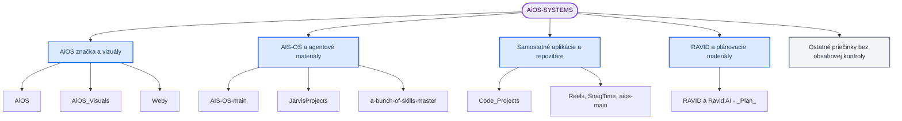

# AiOS-SYSTEMS: celkový prehľad a štruktúra projektov

_Prehľad pracovného priečinka k 24. septembru 2026. Vypracoval Manus AI na základe adresárovej štruktúry, dokumentácie a vybraných zdrojových súborov. Kontrola prebehla bez zmien v existujúcich súboroch._

---

## Celkový záver

`AiOS-SYSTEMS` je **zbierka samostatných projektov a podkladov**, nie jedna aplikácia ani jeden spoločný repozitár. Koreňové pokyny ho priamo opisujú ako workspace bez jednotného príkazu na build alebo test a upozorňujú, že viac kópií môže koexistovať bez toho, aby bola niektorá automaticky aktívna. [1] Inventár zachytáva **21 koreňových priečinkov vrátane skrytého `.claude`** a dva koreňové súbory: `CLAUDE.md` a systémový `.DS_Store`.

Obsah má štyri hlavné, navzájom len interpretačne zoskupené prúdy. Prvým je značka a web **AiOS** pre malé a stredné firmy. Druhým sú osobné AI/agentové pracovné materiály pod označeniami **AIS-OS**, `JarvisProjects` a súvisiace skillové kolekcie. Tretím je katalóg samostatných webových, automatizačných a tutorialových repozitárov. Štvrtým je strategická, vizuálna a vzdelávacia dokumentácia okolo **RAVID/RAVIDO**. Z dostupných dôkazov nevyplýva spoločný deploy, spoločný Git pôvod, zdieľaný runtime ani produktová integrácia týchto prúdov.

Pozorované zdrojové súbory, manifesty a README dokumenty dokazujú najmä **prítomnosť materiálov a deklarované zámery**. Nespúšťali sa inštalácie, buildy, testy, servery ani skripty. Preto ani zdrojový kód, ani README tvrdenie v tomto dokumente neznamená, že príslušná funkcia beží, je aktuálna, bezpečná alebo nasadená.

## Rozsah a interpretačná mapa

Kontrola bola zámerne read-only. Neotvárali sa `.env` a iné credentials, `.claude` konfigurácie, archívy, ZIP súbory, osobné PDF/Word/Excel dokumenty ani surové obchodné dáta. Osobitne sa neindexoval ani nezhŕňal obsah priečinkov `Documents/` a `Archives/`, v súlade s koreňovými pokynmi. [1]

> **Dôležité:** Nasledujúca mapa triedi položky podľa účelu pozorovaného z názvov, README, manifestov a bezpečne čítaných súborov. Kategórie sú **interpretácia pre navigáciu**, nie skutočné závislosti, importy ani architektúra workspace.

## Koreňová štruktúra a pokrytie

Nižšie sú uvedené **všetky presné koreňové priečinky** z inventára. Podrobnejší druhý stupeň je v samostatnom súbore `STRUKTURA-AIOS-SYSTEMS.txt`; ten je praktickejší pri práci v termináli alebo pri orientácii medzi podobnými názvami.

| Koreňová položka | Orientačné zaradenie a rozsah pozorovania |
|---|---|
| `.claude/` | Zaznamenaný názov; obsah neprehliadaný. |
| `AI-REELS-GENERATOR-master/` | Pythonový mediálny pipeline, čítané vybrané bezpečné zdroje a README. |
| `AIS-OS-main/` | Dokumentačno-konfiguračný starter kit pre osobný AI operating system. |
| `AiOS/` | Brand, dokumentácia, vizuálne prompt packy a zdroj brand webu. |
| `AiOS_Visuals/` | Vizuálny asset/prototypový balík. |
| `Archives/` | Zaznamenaný názov; obsah neotvorený. |
| `Claude-20250520-nateherk-main/` | Malý dokumentačný prehľad videí o AI automatizácii. |
| `Code_Projects/` | Katalóg samostatných alebo exportovaných projektov; pozri samostatný katalóg nižšie. |
| `Documents/` | Zaznamenaný názov; obsah neotvorený. |
| `JarvisProjects/` | Dve plytko pozorované Pythonové štruktúry. |
| `MasterClassn8n-main/` | Tutorialový materiál o n8n workflowoch podľa README. |
| `NEROZBALENE ` | Obsah neprehliadaný; názov **končí doslovnou medzerou**. |
| `Obrazky/` | Zaznamenaný názov; obsah neprehliadaný. |
| `Organized/` | Pozorované iba kategórie `Video`, `Design_Assets`, `Images`, `Audio`. |
| `RAVID/` | Strategické a produktové Markdown materiály. |
| `Ravid AI - _Plan_/` | Plánovací/obsahový archív s sektorovými vetvami a kancelárskymi súbormi. |
| `Weby/` | Kolekcia statických webov a frontendových projektov. |
| `a-bunch-of-skills-master/` | Vlastné Claude Code skills a pomocné Node.js/Python skripty. |
| `aios-main/` | Samostatný shellový/ops repozitár, nie AiOS brand web. |
| `promptimizer-main/` | Markdownový Claude skill na štruktúrovanie zadania do promptu. |
| `snagtime-main/` | Node.js workspace so scheduling webovou aplikáciou a Prisma vrstvou. |

Pomenovanie `NEROZBALENE ` je neštandardné len kvôli záverečnej medzere; nejde o typografickú chybu v tomto prehľade. Pri práci v shelli treba používať citovanie, napríklad `'NEROZBALENE '`, aby sa medzera nestratila. `Organized/` sa v rozsahu inventára nevykladá ako projekt: bezpečne sú známe iba štyri názvy jeho kategórií. Pri priečinkoch bez obsahovej kontroly prehľad nevyvodzuje závery o ich obsahu ani aktívnom používaní.

## Hlavné oblasti workspace

### AiOS, vizuály a webové prezentácie

`AiOS/` je najzreteľnejší brandový prúd. Jeho `CLAUDE.md` ho popisuje ako **Advanced Intelligence Operating System** pre B2B malé a stredné firmy a prepája internú dokumentáciu, brandové materiály, prezentačné súbory, prompt packy a webový projekt `brand-site/aios-brand-site (2)/`. [2] Tento web má podľa manifestu a konfigurácie React 19, Vite, TypeScript, Tailwind CSS 4, Express, pnpm, Radix UI, Framer Motion, Recharts a `wouter`; uvedené je ako pozorovaný deklarovaný stack, nie overený runtime. [3]

`AiOS_Visuals/` je odlišný vizuálny/prototypový balík. Koreň obsahuje statický landing prototyp, štruktúru stránky a osem obrazových vizuálov. Jeho vnorený `aios-platform/` je podľa vlastného README alternatívny crypto-fintech/Web3 koncept, takže rovnaký názvový prvok `aios-platform` sám osebe nedokazuje totožnosť s inými cestami. [4] `Weby/` obsahuje samostatnú AiOS landing stránku, lokálnu statickú implementáciu `aios-platform/`, variantu `aios-webhosting/` a Vite demo `demo-auto-detailing/`. Hlavný `Weby/index.html` načítava CSS, JavaScript a assets z `aios-platform/`; to je priama lokálna väzba v rámci `Weby/`, nie dôkaz väzby na ostatné AiOS kópie. [5]

### AI operating systems, Python a skills

Koreňové `AIS-OS-main/` je podľa README starter kit pre Claude Code a Codex: pracuje s kontextom, prepojeniami, schopnosťami a opakovanými automatizáciami. Viditeľné placeholdery a položky „not yet connected“ naznačujú nevyplnený alebo aspoň neoverený onboardingový stav. [6] `JarvisProjects/` obsahuje `aios_app/` s Python dátovými typmi pre agentové požiadavky, odpovede, priority a pamäťové snapshoty a druhú vetvu `AIS-OS-main/` s konfiguráciou a správou konverzačného kontextu. [7] Z toho nemožno vyvodiť, že tieto tri položky používajú ten istý kód alebo sa navzájom importujú.

Koreňové `a-bunch-of-skills-master/` je samostatný skillový projekt. Pozorované definície opisujú skill builder, generovanie vizualizácií cez pomocný Node.js skript a tvorbu brandovaných infografík s Python/Pillow helperom. [8] `promptimizer-main/` je ďalší, obsahovo odlišný skill: prepisuje hrubý návrh úlohy na štruktúrovaný prompt a obsahuje Markdown referencie aj ručné kalibračné scenáre. [9]

### RAVID, plány a vzdelávacie materiály

`RAVID/` je strategický dokumentačný balík. Prečítané Markdown materiály opisujú koncept AI infraštruktúrnej agentúry pre malé a stredné firmy, segmentové AI OS, validáciu ponuky, readiness a procesy s ľudským schválením. Sú to produktové a obchodné návrhy, nie dôkaz existujúcej SaaS implementácie alebo nasadených integrácií. [10] Susedný `Ravid AI - _Plan_/` je obsahový/plánovací archív. Bez otvárania Word, Excel a video súborov boli zaznamenané sektorové vetvy pre krásu a wellness, reality a gastronómiu/hotelierstvo, materiály k RAVIDO agentovi, tipy-triky a názvy plánovacích podkladov.

`MasterClassn8n-main/` a `Claude-20250520-nateherk-main/` sú dokumentačné/tutorialové materiály, nie potvrdené aplikácie. Prvý README opisuje n8n workflowy s Google službami, OpenAI, RAG, Streamlitom a WhatsApp; druhý pozostáva z README a PNG vizualizácie a tematicky sumarizuje AI automatizáciu. [11] [12]

### Samostatné aplikácie a nástroje

`AI-REELS-GENERATOR-master/` má pozorovateľnú Python pipeline na výber AI/tech obsahu, voiceover, kompozíciu vertikálneho videa, titulky a e-mailové oznámenie. Orchestrátor prepája moduly na výber obsahu, zvuk, video a notifikáciu; README tvrdenie o počte vytvorených reels sa však netestovalo. [13] `snagtime-main/` je Node.js workspace s Next.js webovou aplikáciou, Prisma schémami pre SQLite aj PostgreSQL, skriptmi a testovacou štruktúrou. README deklaruje termíny, rezervácie, kalendárovú synchronizáciu, e-mail a Stripe test mode; nič z toho nebolo spúšťané. [14]

`aios-main` má úplne inú identitu než brand AiOS alebo AIS-OS: koreňové pokyny ho označujú za samostatnú stiahnutú kópiu a README ho opisuje ako kolekciu shellových administračných nástrojov pre serverové, sieťové, proxy a cloudové úlohy. README navyše deklaruje, že vetva v2.0.0 je momentálne nefunkčná. [1] [15] Preto sa tento priečinok nemá interpretovať ako produktová implementácia značky AiOS.

## Katalóg priamych detí `Code_Projects/`

`Code_Projects/` je kolekcia, nie potvrdený jednotný projekt. Nasleduje kompletný katalóg jeho **16 priamych detí** z inventára; účel a stack sú zjednodušené popisy pozorovaných súborov, nie runtime záruky. [16]

| Priečinok | Pozorovaný účel a technológie |
|---|---|
| `claude-seo-prompt-pack-main/` | Prompt pack pre tvorbu, optimalizáciu a publikovanie webu cez Claude Code; Markdown/text/HTML/PDF. |
| `Ai-Website-Builder-main/` | Deklarovaná AI platforma na tvorbu webov z prirodzeného jazyka; Next.js 15, React, TypeScript, Tailwind, Convex a Gemini. |
| `aios-brand-site/` | Brand/site web s `client`, `server`, `shared`; Vite, React 19, TypeScript, Express a Tailwind 4. |
| `Mark-LII-main/` | Deklarovaný cross-platform hlasový AI asistent; Python, PyQt6, Google AI, FastAPI/Uvicorn. |
| `AIS-OS-main/` | Osobný AI operating system s Python skriptom, knowledge base, konfiguráciami a skriptmi. |
| `aios-permanent (1)/` | Webový AIOS kandidát s klientom, serverom, shared kódom, Drizzle, pnpm workspace a Vitest. |
| `scroll-craft-main/` | Skill/plugin pre scroll-driven weby; README spomína GSAP, video a browserové overovanie. |
| `a-bunch-of-skills-master/` | Ďalšia pracovná kópia/kandidát skillového workspace; presný vzťah ku koreňovej verzii neoverený. |
| `GenWebScraper-master/` | Web scraper podľa manifestu; Next.js 14, React 18, Firecrawl, Tailwind a Radix UI. |
| `aios-landing/` | Landing/prototyp s HTML, CSS, JavaScriptom a TSX demo komponentom. |
| `scroll-craft-main 2/` | Druhá pomenovaná varianta/kandidát k `scroll-craft-main`; identita nie je potvrdená. |
| `ottomator-agents-main/` | Rozsiahla kolekcia agentových príkladov a workflowov; zmiešaný Python/Node/Docker charakter. |
| `awesome-web-prompts-main/` | Katalóg web-development promptov a príkladového kódu. |
| `agentskills-main/` | Formát a materiály Agent Skills; Markdown skills a prítomný npm manifest. |
| `hyperframes-student-kit-main/` | Študentský kit pre HTML/video motion workflow s Node/JavaScript artefaktmi. |
| `local-ai-care-package/` | Návody a webové skills; README uvádza Vite, Three.js, GSAP ScrollTrigger a Lenis. |

## Rovnaké a podobné názvy: čo znamenajú a čo nie

V workspace sa opakujú alebo približujú názvy `AIS-OS-main`, `a-bunch-of-skills-master`, `aios-brand-site`, `aios-platform` a `scroll-craft-main`. Najvýraznejšie cesty sú `AIS-OS-main/`, `Code_Projects/AIS-OS-main/` a `JarvisProjects/AIS-OS-main/`; `a-bunch-of-skills-master/` a `Code_Projects/a-bunch-of-skills-master/`; `Code_Projects/aios-brand-site/` a `AiOS/brand-site/aios-brand-site (2)/`; `Weby/aios-platform/` a `AiOS_Visuals/aios-platform/`; a `Code_Projects/scroll-craft-main/` spolu s `Code_Projects/scroll-craft-main 2/`.

Tieto cesty sú **kandidáti na paralelné verzie, exporty alebo duplicitné kópie**, nie potvrdené binárne alebo zdrojovo identické súbory. Suffix `(1)` či `2` signalizuje iba názvovú konvenciu, nie poradie aktuálnosti. Neoverovali sa hash hodnoty, Git histórie, vzdialené repozitáre, dátumy, rozdiely súborov ani deploymenty. Pre bezpečnú navigáciu preto používajte vždy plnú cestu a konkrétny README/manifest danej vetvy.

## Navigácia a limity

Pre brand AiOS je vhodný štart `CLAUDE.md` v koreni, následne `AiOS/CLAUDE.md` a až potom presná vetva `AiOS/brand-site/aios-brand-site (2)/`. Pre statické prezentácie začnite v `Weby/`; pre vizuálne podklady v `AiOS_Visuals/`; pre agentové materiály rozlišujte koreňové `AIS-OS-main/`, `JarvisProjects/` a skillové repozitáre. `Code_Projects/` používajte ako katalóg a nie ako implicitný build root. Úplný orientačný strom je v [STRUKTURA-AIOS-SYSTEMS.txt](./STRUKTURA-AIOS-SYSTEMS.txt).

Tento dokument nehodnotí kvalitu kódu, licencie mimo pozorovaných deklarácií, bezpečnosť, závislosti, kompatibilitu, údaje zákazníkov ani prevádzkový stav. Neurčuje, ktorá kópia je aktívna alebo najnovšia, a neodporúča reorganizáciu workspace. Na určenie aktuálnej pracovnej kópie by bolo potrebné porovnať konkrétne vetvy a ich históriu; funkčnosť by bolo potrebné overiť samostatnými testami.

## Referencie

[1]: /mnt/a65d2a5a-10f0-4339-85c9-efaec5255f62/AiOS-SYSTEMS/CLAUDE.md "AiOS-SYSTEMS — CLAUDE.md"
[2]: /mnt/a65d2a5a-10f0-4339-85c9-efaec5255f62/AiOS-SYSTEMS/AiOS/CLAUDE.md "AiOS — CLAUDE.md"
[3]: /mnt/a65d2a5a-10f0-4339-85c9-efaec5255f62/AiOS-SYSTEMS/AiOS/brand-site/aios-brand-site%20%282%29/package.json "AiOS brand site — package.json"
[4]: /mnt/a65d2a5a-10f0-4339-85c9-efaec5255f62/AiOS-SYSTEMS/AiOS_Visuals/aios-platform/README.md "AiOS Visuals aios-platform — README.md"
[5]: /mnt/a65d2a5a-10f0-4339-85c9-efaec5255f62/AiOS-SYSTEMS/Weby/index.html "Weby — index.html"
[6]: /mnt/a65d2a5a-10f0-4339-85c9-efaec5255f62/AiOS-SYSTEMS/AIS-OS-main/README.md "AIS-OS-main — README.md"
[7]: /mnt/a65d2a5a-10f0-4339-85c9-efaec5255f62/AiOS-SYSTEMS/JarvisProjects/AIS-OS-main/memory/context.py "JarvisProjects AIS-OS-main — memory context"
[8]: /mnt/a65d2a5a-10f0-4339-85c9-efaec5255f62/AiOS-SYSTEMS/a-bunch-of-skills-master/CLAUDE.md "a-bunch-of-skills-master — CLAUDE.md"
[9]: /mnt/a65d2a5a-10f0-4339-85c9-efaec5255f62/AiOS-SYSTEMS/promptimizer-main/README.md "promptimizer-main — README.md"
[10]: /mnt/a65d2a5a-10f0-4339-85c9-efaec5255f62/AiOS-SYSTEMS/RAVID/RAVID%20AI%203.0.md "RAVID AI 3.0"
[11]: /mnt/a65d2a5a-10f0-4339-85c9-efaec5255f62/AiOS-SYSTEMS/MasterClassn8n-main/README.md "MasterClassn8n-main — README.md"
[12]: /mnt/a65d2a5a-10f0-4339-85c9-efaec5255f62/AiOS-SYSTEMS/Claude-20250520-nateherk-main/README.md "Claude-20250520-nateherk-main — README.md"
[13]: /mnt/a65d2a5a-10f0-4339-85c9-efaec5255f62/AiOS-SYSTEMS/AI-REELS-GENERATOR-master/README.md "AI-REELS-GENERATOR-master — README.md"
[14]: /mnt/a65d2a5a-10f0-4339-85c9-efaec5255f62/AiOS-SYSTEMS/snagtime-main/README.md "snagtime-main — README.md"
[15]: /mnt/a65d2a5a-10f0-4339-85c9-efaec5255f62/AiOS-SYSTEMS/aios-main/README.md "aios-main — README.md"
[16]: /mnt/a65d2a5a-10f0-4339-85c9-efaec5255f62/AiOS-SYSTEMS/Code_Projects/ "Code_Projects — directory inventory"
